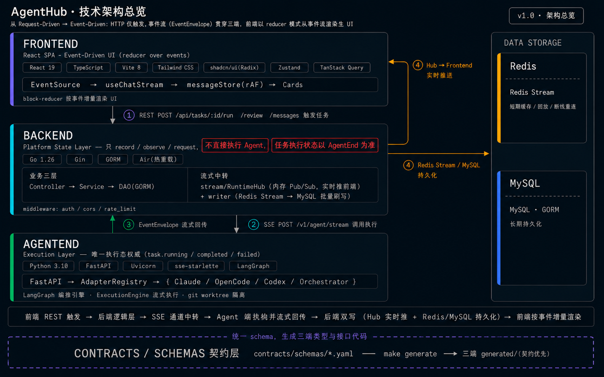

<p align="center">
  
</p>

<h1 align="center">AgentHub — 多 Agent 协作平台</h1>

> 以 IM 聊天为核心范式，让用户像用飞书 / 微信一样与多个 AI Agent 协作。

AgentHub 是一个多 Agent 协作平台。每个 Agent 就是一个「聊天对象」，用户可以单聊、建群、@指定，由 Orchestrator 自动拆解任务、分派给合适的子 Agent，最终聚合产出。支持 Claude Code、OpenCode、Codex 三类 Agent 统一接入，新增 Agent 前端零改动。

<p align="center">
  
</p>

---

## 核心能力

| 能力 | 说明 |
|------|------|
| **IM 聊天交互** | 对话列表、单聊 / 群聊、消息引用、历史搜索、会话置顶 |
| **Orchestrator 编排** | 群聊模式自动拆解任务 → 分派子 Agent → 聚合产出，支持规划审查、合并冲突重规划 |
| **三 Agent 统一接入** | Claude Code / OpenCode / Codex 经 Adapter 层适配，Registry 注册即用 |
| **SSE 实时流式** | 逐 token 流式输出、断线重连、Redis Stream 持久缓冲、三级存储（Hub → Redis → MySQL） |
| **产物内联预览** | 代码 Diff、网页预览、文件附件等富媒体卡片，聊天流中直接预览 |
| **工作区隔离** | 每 Agent 独立 git worktree + 独立分支，互不污染，支持 merge / revert |
| **Skills 分发** | 内置 Skill 按需加载 + 外部 Skill 上传 / 导入 / 删除，SOUL.md 身份文档 |
| **通讯录管理** | Agent 分组展示、头像自定义、置顶会话、退群 |

<p align="center">
  
</p>

---

## 技术架构

| 层 | 技术栈 | 职责 |
|----|--------|------|
| **Frontend** | React 19 · Vite 8 · TypeScript · Tailwind CSS · shadcn/ui | IM 聊天界面、会话管理、产物预览、Admin 面板 |
| **Backend** | Go · Gin · GORM · MySQL · Redis Stream | SSE 透传、CRUD、消息持久化、Admin API、头像存储（七牛云） |
| **AgentEnd** | Python · FastAPI · LangGraph | Agent 适配器、Orchestrator 编排、workspace 隔离、Skill 分发 |
| **Contracts** | YAML Schema → Python / TypeScript / Go 代码生成 | 跨端协议单一来源，杜绝类型漂移 |

---

## 目录结构

```
bytedanceai/
├── frontend/          # React 前端
├── backend/           # Go 后端
├── agentend/          # Python Agent 端
├── contracts/         # 三端共享契约（schemas + logs）
├── docs/              # 项目文档（设计/指南/测试/缺陷记录等）
├── docker/            # Docker 部署（docker-compose.yml + Nginx）
├── scripts/           # 工程脚本（启停 / 契约生成 / 数据清理）
├── Makefile           # 统一命令入口
└── AGENTS.md          # 项目上下文索引
```

---

## 快速开始

### 环境要求

- Node.js 22+、pnpm 9+
- Go 1.24+
- Python 3.12+、uv
- MySQL 8.0、Redis 7+

### 启动

```bash
# 启动全部服务（热重载）
make                  # 前端 :5173 + 后端 :8080 + Agent 端 :8001

# 也可单独启动
make run-frontend     # 前端
make run-backend      # 后端
make run-agentend     # Agent 端

# 查看三端运行状态
make status
```

### Docker 部署

```bash
make docker-up        # 构建并启动容器 + 本地启动 Agent 端
make docker-down      # 停止并移除容器
```

启动后访问 `http://localhost:8787`（Nginx 反向代理，前端 :8787 → 后端 :8080）。

详见 [Docker 部署指南](docs/guides/docker-deployment.md)。

---

## 交付物原型

| 交付物原型 | 文档 |
|--------|------|
| 产品设计文档（PRD） | [docs/internal/sub/产品设计文档.md](docs/internal/sub/产品设计文档.md) |
| 技术文档（TDD） | [docs/internal/sub/技术文档.md](docs/internal/sub/技术文档.md) |
| AI 协作开发记录 | [docs/internal/sub/AI协作开发记录.md](docs/internal/sub/AI协作开发记录.md) |
| 可运行 Demo | 启动后访问 `http://localhost:5173` |

---

## License

MIT
