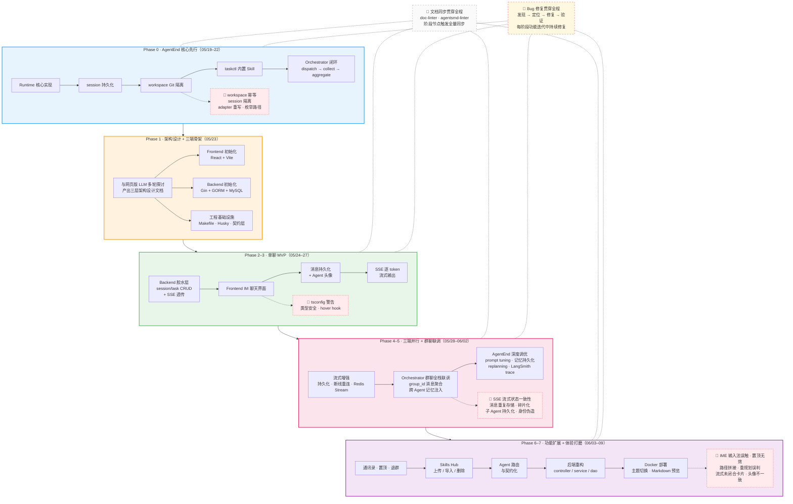

# 全流程开发节奏

```mermaid
flowchart TD
    subgraph P0["Phase 0 · AgentEnd 核心先行（05/19–22）"]
        direction LR
        A1["Runtime 核心实现"] --> A2["session 持久化"] --> A3["workspace Git 隔离"] --> A4["taskctl 内置 Skill"] --> A5["Orchestrator 闭环<br/>dispatch → collect → aggregate"]
        A3 -.-> A6["🐛 workspace 幂等<br/>session 隔离<br/>adapter 重写 · 枚举路径"]
    end

    subgraph P1["Phase 1 · 架构设计 + 三端骨架（05/23）"]
        B0["与网页版 LLM 多轮探讨<br/>产出三层架构设计文档"]
        B0 --> B1["Frontend 初始化<br/>React + Vite"]
        B0 --> B2["Backend 初始化<br/>Gin + GORM + MySQL"]
        B0 --> B3["工程基础设施<br/>Makefile · Husky · 契约层"]
    end

    subgraph P23["Phase 2–3 · 单聊 MVP（05/24–27）"]
        direction LR
        C1["Backend 胶水层<br/>session/task CRUD<br/>+ SSE 透传"] --> C2["Frontend IM 聊天界面"] --> C3["消息持久化<br/>+ Agent 头像"] --> C4["SSE 逐 token<br/>流式输出"]
        C2 -.-> C5["🐛 tsconfig 警告<br/>类型安全 · hover hook"]
    end

    subgraph P45["Phase 4–5 · 三端并行 + 群聊联调（05/28–06/02）"]
        D1["流式增强<br/>持久化 · 断线重连 · Redis Stream"] --> D2["Orchestrator 群聊全栈联调<br/>group_id 消息聚合<br/>跨 Agent 记忆注入"]
        D2 --> D3["AgentEnd 深度调优<br/>prompt tuning · 记忆持久化<br/>replanning · LangSmith trace"]
        D2 -.-> D4["🐛 SSE 流式状态一致性<br/>消息重复存储 · 碎片化<br/>子 Agent 持久化 · 身份伪造"]
    end

    subgraph P67["Phase 6–7 · 功能扩展 + 体验打磨（06/03–09）"]
        direction LR
        E1["通讯录 · 置顶 · 退群"] --> E2["Skills Hub<br/>上传 / 导入 / 删除"] --> E3["Agent 路由<br/>与契约化"] --> E4["后端重构<br/>controller / service / dao"] --> E5["Docker 部署<br/>主题切换 · Markdown 预览"]
        E5 -.-> E6["🐛 IME 输入法误触 · 置顶无效<br/>路径拼接 · 重规划误判<br/>流式未闭合卡片 · 头像不一致"]
    end

    P0 --> P1 --> P23 --> P45 --> P67

    DOC["📄 文档同步贯穿全程<br/>doc-linter · agentsmd-linter<br/>阶段节点触发全量同步"]
    DOC -.- P0
    DOC -.- P23
    DOC -.- P45
    DOC -.- P67

    BUG["🐛 Bug 修复贯穿全程<br/>发现 → 定位 → 修复 → 验证<br/>每阶段功能迭代中持续修复"]
    BUG -.- P0
    BUG -.- P23
    BUG -.- P45
    BUG -.- P67

    style P0 fill:#e8f4fd,stroke:#2196f3,stroke-width:2px
    style P1 fill:#fff3e0,stroke:#ff9800,stroke-width:2px
    style P23 fill:#e8f5e9,stroke:#4caf50,stroke-width:2px
    style P45 fill:#fce4ec,stroke:#e91e63,stroke-width:2px
    style P67 fill:#f3e5f5,stroke:#9c27b0,stroke-width:2px
    style DOC fill:#fafafa,stroke:#9e9e9e,stroke-dasharray:5 5
    style BUG fill:#fff8e1,stroke:#f44336,stroke-dasharray:5 5
    style A6 fill:#ffebee,stroke:#ef5350,stroke-dasharray:3 3
    style C5 fill:#ffebee,stroke:#ef5350,stroke-dasharray:3 3
    style D4 fill:#ffebee,stroke:#ef5350,stroke-dasharray:3 3
    style E6 fill:#ffebee,stroke:#ef5350,stroke-dasharray:3 3
```
